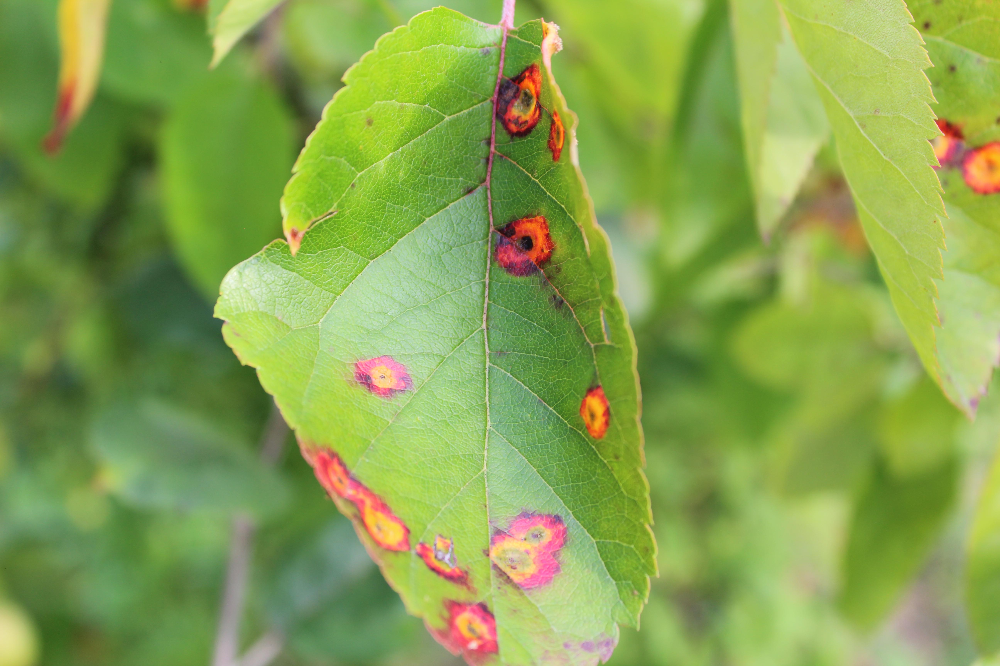
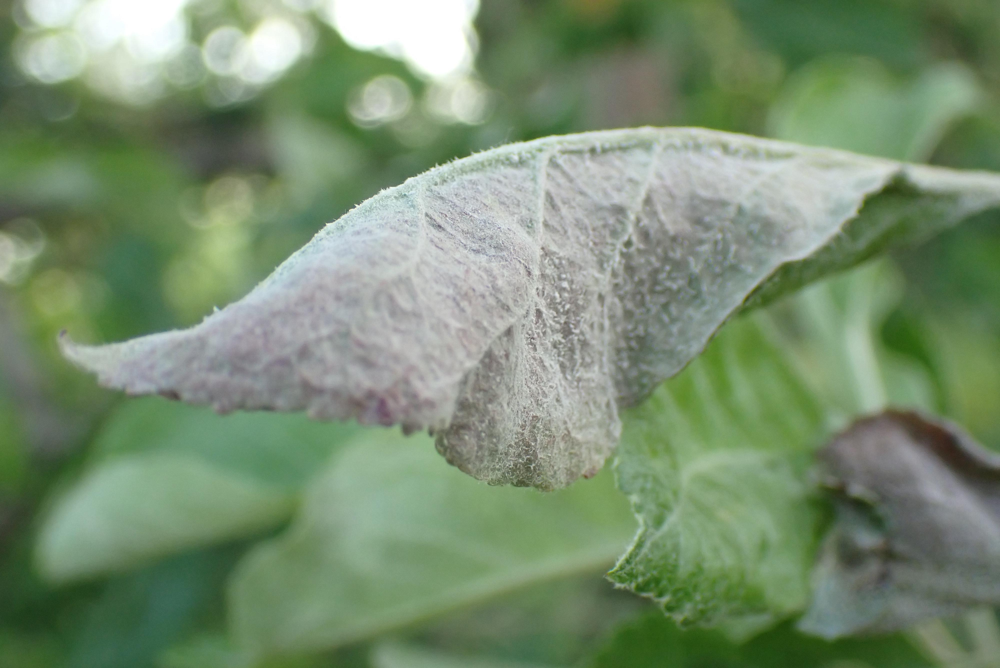

<!DOCTYPE html>
<html lang="en">
<head>
    <meta charset="UTF-8">
    <meta name="viewport" content="width=device-width, initial-scale=1.0">
    <title>Plant Health Classifier</title>
    
</head>
<body>
    <h1>Plant Health Classifier</h1>
    

        <button type="button" onclick="init()">Start Webcam</button>
    

    

    

    <h2>Sample Images</h2>
    

        
        
        
        
        
        
        
        
        
    

    
    
    
</body>
</html>
